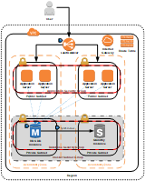

# RDS Reference Architectures

## Overview

Todo: Overview

## Deployment Architectures

Because AWS Services are designed to work together, most AWS services are consistent in how they are deployed, and you don't have to make many architectural decisions to get the service online. However, you do have to decide how to structure your [Virtual Private Cloud (VPC)](https://aws.amazon.com/vpc) network, and where services reside within it. The following architectures provide common patterns for how customers deploy applications and databases using Amazon RDS. These architectures range from one database in a single region to scaling out across multiple regions. In these examples, an internet accessible application is deployed into a public subnet, and the database(s) supporting the application are hosted in a private subnet that is not accessible to the internet.

### [Single Region with Hot Standby](src/single-region)

<table><tr><td></td><td>This is the most basic architecture recommended for an RDS database. It uses a single database for all read and write operations while synchronously replicating data to a second availability zone for high availability. A security group for the database instances restricts database connections to only the application servers in a separate application security group, preventing all other connection attempts. Other architectures build on this approach to networking, so it is recommended to start by reviewing this architecture.</td></tr></table>

### [Single Region Scale Out Using RDS Read Replicas](src/single-region-scale-out)

<table><tr><td></td><td>For read heavy applications, the database environment can be scaled out across multiple read replicas to reduce the load on the master database. Application servers read data from the replicas, and only write to the master database.</td></tr></table>

### [Multi-Region Scale Out Using RDS Read Replicas](src/multi-region-scale-out)

<table><tr><td></td><td>To increase performance for users around the world, read replicas can be distributed across multiple regions. This reduces latency between the user and the application, providing a better application experience.</td></tr></table>

### [Single Region Scale Out Using Aurora Read Replicas](src/single-region-scale-out-aurora)

<table><tr><td></td><td>Aurora enables a simplified architecture for scaling out with read replicas. With a separate reader endpoint provided out-of-the-box, the Aurora read replicas can also be used for high availability, eliminating the need for a separate hot standby instance.</td></tr></table>

### [Multi-Region Scale Out Using Aurora Read Replicas](src/multi-region-scale-out-aurora)

<table><tr><td></td><td>Similar to the single region scale out example, Aurora read replicas can be scaled across regions by replicating data from one cluster to another.</td></tr></table>
