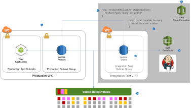
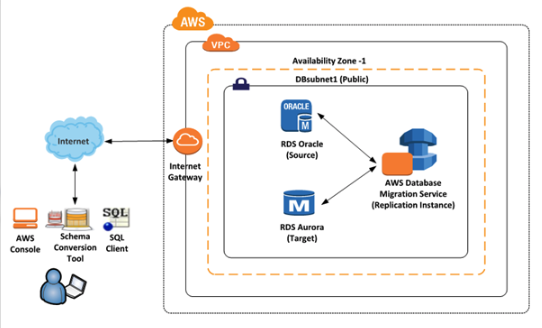
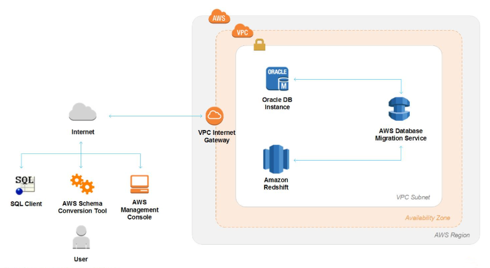

# RDS Reference Architectures

## Overview

#### Amazon RDS

[Amazon Relational Database Service (Amazon RDS)](https://aws.amazon.com/rds) makes it easy to set up, operate, and scale a relational database in the cloud. It provides cost-efficient and resizable capacity while automating time-consuming administration tasks such as hardware provisioning, database setup, patching and backups. It frees you to focus on your applications so you can give them the fast performance, high availability, security and compatibility they need.

* When you buy a database server outside of AWS, you must purchase CPU, memory, storage, and IOPS all bundled together. With Amazon RDS, these are split apart so that you can scale them independently based on your workload. If you need more CPU, more IOPS, or more storage, you can easily allocate them on demand over time, and only pay for what you use.
* [Amazon RDS manages backups](https://docs.aws.amazon.com/AmazonRDS/latest/UserGuide/USER_WorkingWithAutomatedBackups.html), [operating system and database software patching](https://docs.aws.amazon.com/AmazonRDS/latest/UserGuide/USER_UpgradeDBInstance.Maintenance.html), and [automatic failure detection, and recovery](https://docs.aws.amazon.com/AmazonRDS/latest/UserGuide/Concepts.MultiAZ.html).
* RDS takes snapshots of your database automatically, and or you can manually create your own backup snapshots. You can use these backups to [restore a database to a point in time](https://docs.aws.amazon.com/AmazonRDS/latest/UserGuide/USER_PIT.html). 
* You can get high availability with a primary instance and a synchronous secondary instance that you can fail over to if problems occur. You can also use [MySQL, MariaDB, or PostgreSQL Read Replicas](https://aws.amazon.com/rds/details/read-replicas) to increase read scaling.
* You can use the database products you are already familiar with: MySQL, MariaDB, PostgreSQL, Oracle, Microsoft SQL Server.
* In addition to the security in your database package, you can [control who can access your RDS databases](https://docs.aws.amazon.com/AmazonRDS/latest/UserGuide/UsingWithRDS.html) by using AWS Identity and Access Management (IAM) to define users and permissions. You can also help [protect your databases by putting them in a Virtual Private Cloud (VPC)](https://docs.aws.amazon.com/AmazonRDS/latest/UserGuide/USER_VPC.html).

#### Amazon Aurora

[Amazon Aurora (Aurora)](https://aws.amazon.com/rds/aurora) is a fully managed relational database engine that's compatible with MySQL and PostgreSQL. You already know how MySQL and PostgreSQL combine the speed and reliability of high-end commercial databases with the simplicity and cost-effectiveness of open-source databases. The code, tools, and applications you use today with your existing MySQL and PostgreSQL databases can be used with Aurora. With some workloads, Aurora can deliver up to five times the throughput of MySQL and up to three times the throughput of PostgreSQL without requiring changes to most of your existing applications.

The following points illustrate how Aurora relates to the standard MySQL and PostgreSQL engines available in Amazon RDS:

* You choose Aurora as a DB engine option when setting up new database servers through Amazon RDS.
* Aurora takes advantage of the familiar RDS features for management and administration. Aurora provides the same Management Console interface, AWS CLI commands, and APIs to handle routine database tasks such as provisioning, patching, backup, recovery, failure detection, and repair.
* Aurora management operations typically involve entire clusters of database servers that are synchronized through replication, instead of individual database instances. The automatic clustering, replication, and storage allocation make it simple and cost-effective to set up, operate, and scale your largest MySQL and PostgreSQL deployments.
* You can bring data from Amazon RDS for MySQL and Amazon RDS for PostgreSQL into Aurora by creating and restoring snapshots, [creating Aurora read replicas](https://docs.aws.amazon.com/AmazonRDS/latest/AuroraUserGuide/aurora-replicas-adding.html), or by [setting up bulk and real-time replication with Amazon Database Migration Service (DMS)](https://aws.amazon.com/dms). You can use push-button migration tools to convert your existing Amazon RDS for MySQL and Amazon RDS for PostgreSQL applications to Aurora.

## Use Cases 

#### Operational Systems

Amazon RDS and Aurora is used as a highly available, no maintenance backend for operational systems. It has been a system of records for [many e-commerce websites, ERP, CRM and HR systems](https://aws.amazon.com/rds/customers) where SQL databases widely used.

#### Small Size Analytic Data Stores

Though, large scale data warehouses are not very common use cases for RDS/Aurora, it is not impossible to build solutions with relational database service on AWS. Many customers have successfully deployed analytic solutions with RDS as the data store due to its ease of use and scalability. 

Selection of an analytic database depends on many factors such as scalability, data volume, query volume, type of queries  and data availability SLA etc. However, RDS is widely used by many of our customers for realtime operational reporting on the OLTP systems. As a best practice, we discourage using RDS master instances for operational reporting. Such implementations may compromize availability of the OLTP system. It is recommended to use read replicas for ad-hoc queries, reporting or data extraction source for ETL/ELT systems.

## Data Modeling Principles

Based on the type of workload your database is handling, the data model design techniques vary accordingly. Nearly all rdbms systems, that deal with online transaction processing, use one of standard database modelling principles.  

### [Online Transaction Processing](https://en.wikipedia.org/wiki/Online_transaction_processing)

<table><tr>
  <td></td>
  <td><ul>
    <li>Normalized(3NF) data modeling principle is suitable for transactional systems.</li>
    <li>Generally, the systems that has high amount of updates and inserts on small number of rows frequently use normalized schema design to support online transactional processing.</li>
    <li>Database systems that handle such workload are generally used as backend data store of e-commerce websites, ERP and  CRM systems etc.</li>
  </ul></td>
</tr></table>

## Deployment Architectures

AWS services are designed to work together, and most AWS services are consistent in how they are deployed, and you don't have to make many architectural decisions to get the service online. However, you do have to decide how to structure your [Virtual Private Cloud (VPC)](https://aws.amazon.com/vpc) network, and where services reside within it. The following architectures provide common patterns for how customers deploy applications and databases using Amazon RDS. These architectures range from one database in a single region to scaling out across multiple regions. In these examples, an internet accessible application is deployed into a public subnet, and the database(s) supporting the application are hosted in a private subnet that is not accessible to the internet.

### [Multi-AZ](src/multi-az)

<table><tr><td></td><td>This is the most basic architecture recommended for an RDS database. It uses a single database for all read and write operations while synchronously replicating data to a second availability zone for high availability. A security group for the database instances restricts database connections to only the application servers in a separate application security group, preventing all other connection attempts. Other architectures build on this approach to networking, so it is recommended to start by reviewing this architecture.</td></tr></table>

### [Single Region Scale Out Using RDS Read Replicas](src/single-region-scale-out)

<table><tr><td></td><td>For read heavy applications, the database environment can be scaled out across multiple read replicas to reduce the load on the master database. Application servers read data from the replicas, and only write to the master database.</td></tr></table>

### [Multi-Region Scale Out Using RDS Read Replicas](src/multi-region-scale-out)

<table><tr><td></td><td>To increase performance for users around the world, read replicas can be distributed across multiple regions. This reduces latency between the user and the application, providing a better application experience.</td></tr></table>

### [Single Region Scale Out Using Aurora Read Replicas](src/single-region-scale-out-aurora)

<table><tr><td></td><td>Aurora enables a simplified architecture for scaling out with read replicas. With a separate reader endpoint provided out-of-the-box, the Aurora read replicas can also be used for high availability, eliminating the need for a separate hot standby instance.</td></tr></table>

### [Multi-Region Scale Out Using Aurora Read Replicas](src/multi-region-scale-out-aurora)

<table><tr><td></td><td>Similar to the single region scale out example, Aurora read replicas can be scaled across regions by replicating data from one cluster to another.</td></tr></table>

## Application Architectures

### [Using Clone and Backtrack for Integration Testing](src/clone-backtrack-testing)

<table><tr><td></td><td>Amazon Aurora supports powerful features to clone running databases in minutes, and to 'rewind' a database to any point in time using Aurora Backtrack. This can be a powerful capability to facilitate application architectures, for example service integration testing.</td></tr></table>

## Migrating Databases

### [Migrating from Oracle to Aurora Mysql](https://aws.amazon.com/getting-started/projects/migrate-oracle-to-amazon-aurora)

Migrating your Oracle database to Amazon Aurora can substantially reduce your database costs, while improving reliability and performance. Amazon Aurora is a fully-managed high-performance database with the security, availability, and reliability of a commercial database, at one-tenth the cost. AWS Database Migration Service and AWS Schema Conversion Tool make it easier to perform this migration with minimal disruption to the applications that rely on the source database.

Use [this Migration site](https://aws.amazon.com/getting-started/projects/migrate-oracle-to-amazon-aurora) as a step-by-step guide to performing the migration, which includes a [CloudFormation](https://dms-sbs.s3.amazonaws.com/Oracle_Aurora_RDS_For_DMSDemo.template) Template to facilitate service configuration.

### [Migrating from Oracle to Aurora Postgres](https://d1.awsstatic.com/whitepapers/Migration/oracle-database-amazon-aurora-postgresql-migration-playbook.pdf)

To migrate an Oracle database to Amazon Aurora with PostgreSQL Compatibility, you usually need to perform both automated and manual tasks. The automated tasks involve data migration and schema conversion using the AWS Database Migration Service (AWS DMS) and AWS Schema Conversion Tool (AWS SCT). The manual tasks involve post-migration “touch-ups” for certain database objects that can’t be migrated automatically.

Use [this Migration playbook](https://d1.awsstatic.com/whitepapers/Migration/oracle-database-amazon-aurora-postgresql-migration-playbook.pdf) to plan and implement your migration process.

### [Migrating from Oracle to Amazon Redshift](https://aws.amazon.com/getting-started/projects/migrate-oracle-to-amazon-redshift)

Migrating your Oracle data warehouse to Amazon Redshift can substantially improve query and data load performance, increase scalability, and save costs. Amazon Redshift is a fast, fully managed, petabyte-scale data warehouse that makes it simple and cost-effective to analyze all your data using your existing business intelligence tools. AWS Database Migration Service and AWS Schema Conversion Tool make it easier to migrate your schema and data from your Oracle data warehouse, both on-premises and on AWS, to Amazon Redshift without disruption to the applications that rely on the data source.

Use [this Migration site](https://aws.amazon.com/getting-started/projects/migrate-oracle-to-amazon-redshift) as a step-by-step guide to performing the migration

### [Migrating from Microsoft SQL Server to Aurora Mysql](https://d1.awsstatic.com/asset-repository/RDS%20Data%20Migration/SQL%20Server%20to%20Aurora%20MySQL%20Migration%20Playbook.pdf)

To migrate a Microsoft SQL Server database to Amazon Aurora with Mysql Compatibility, you usually need to perform both automated and manual tasks. The automated tasks involve data migration and schema conversion using the AWS Database Migration Service (AWS DMS) and AWS Schema Conversion Tool (AWS SCT). The manual tasks involve post-migration “touch-ups” for certain database objects that can’t be migrated automatically.

Use [this Migration playbook](https://d1.awsstatic.com/asset-repository/RDS%20Data%20Migration/SQL%20Server%20to%20Aurora%20MySQL%20Migration%20Playbook.pdf) to plan and implement your migration process.

## License Summary

This sample code is made available under a modified MIT license. See the LICENSE file.
