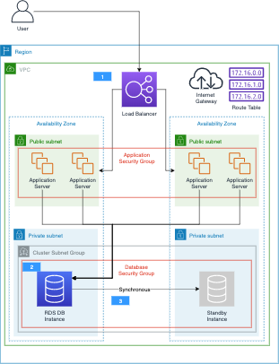

# RDS Reference Architectures

## Overview

#### Amazon RDS

Amazon Relational Database Service (Amazon RDS) makes it easy to set up, operate, and scale a relational database in the cloud. It provides cost-efficient and resizable capacity while automating time-consuming administration tasks such as hardware provisioning, database setup, patching and backups. It frees you to focus on your applications so you can give them the fast performance, high availability, security and compatibility they need.

  -  When you buy a server, you get CPU, memory, storage, and IOPS, all bundled together. With Amazon RDS, these are split apart so that you can scale them independently. If you need more CPU, less IOPS, or more storage, you can easily allocate them.

  -  Amazon RDS manages backups, software patching, automatic failure detection, and recovery.

  -  To deliver a managed service experience, Amazon RDS doesn't provide shell access to DB instances, and it restricts access to certain system procedures and tables that require advanced privileges.

  -  You can have automated backups performed when you need them, or manually create your own backup snapshot. You can use these backups to restore a database. The Amazon RDS restore process works reliably and efficiently.

  -  You can get high availability with a primary instance and a synchronous secondary instance that you can fail over to when problems occur. You can also use MySQL, MariaDB, or PostgreSQL Read Replicas to increase read scaling.

  -  You can use the database products you are already familiar with: MySQL, MariaDB, PostgreSQL, Oracle, Microsoft SQL Server.

  -  In addition to the security in your database package, you can help control who can access your RDS databases by using AWS Identity and Access Management (IAM) to define users and permissions. You can also help protect your databases by putting them in a virtual private cloud.

#### Amazon Aurora
Amazon Aurora (Aurora) is a fully managed relational database engine that's compatible with MySQL and PostgreSQL. You already know how MySQL and PostgreSQL combine the speed and reliability of high-end commercial databases with the simplicity and cost-effectiveness of open-source databases. The code, tools, and applications you use today with your existing MySQL and PostgreSQL databases can be used with Aurora. With some workloads, Aurora can deliver up to five times the throughput of MySQL and up to three times the throughput of PostgreSQL without requiring changes to most of your existing applications.

  The following points illustrate how Aurora relates to the standard MySQL and PostgreSQL engines available in Amazon RDS

  - You choose Aurora as a DB engine option when setting up new database servers through Amazon RDS.

  - Aurora takes advantage of the familiar Amazon Relational Database Service (Amazon RDS) features for management and administration. Aurora uses the Amazon RDS AWS Management Console interface, AWS CLI commands, and APIs to handle routine database tasks such as provisioning, patching, backup, recovery, failure detection, and repair.

  - Aurora management operations typically involve entire clusters of database servers that are synchronized through replication, instead of individual database instances. The automatic clustering, replication, and storage allocation make it simple and cost-effective to set up, operate, and scale your largest MySQL and PostgreSQL deployments.

  - You can bring data from Amazon RDS for MySQL and Amazon RDS for PostgreSQL into Aurora by creating and restoring snapshots, or by setting up one-way replication. You can use push-button migration tools to convert your existing Amazon RDS for MySQL and Amazon RDS for PostgreSQL applications to Aurora.

## Use Cases

- #### Operational Systems
Amazon RDS  and Aurora is used as a highly available, no maintenance backend for operational systems. It has been a system of records for many e-commerce websites, ERP, CRM and HR systems where SQL databases widely used.

- #### Small Size Analytic Data Stores
Though, large scale data warehouses are not very common use case with RDS/Aurora, it is feasible to build solutions with relational data database service on AWS. Many customers have successfully deployed analytic solutions with RDS as a data store due to its ease of use and scalability. However, it is recommended to use Amazon Redshift where a large enterprise data warehouse use case arises.

## Data Modeling Principles
Based on  type of workload your database is handling, the data model design techniques vary accordingly. 2 major data modeling techniques are widely used in the industry bases on type of workload and system that  your database is supporting.  

- #### Normalized Schema Design (3NF)
<table><tr><td></td><td><ul><li>Normalized(3NF) data modeling principle is suitable for transactional systems. </li><li>
Generally, the systems that has high amount of updates and inserts on small number of rows frequently use normalized schema design to support online transactional processing.</li> <li>Database systems that handle such workload are generally used as backend data store of e-commerce websites, ERP and  CRM systems etc.</li>
</ul>
The diagram is an example of a relational data model design for a advertisement service.
 </td></tr></table>

- #### De-normalized Schema Design (Star Schema)

## Deployment Architectures

AWS Services are designed to work together, most AWS services are consistent in how they are deployed, and you don't have to make many architectural decisions to get the service online. However, you do have to decide how to structure your [Virtual Private Cloud (VPC)](https://aws.amazon.com/vpc) network, and where services reside within it. The following architectures provide common patterns for how customers deploy applications and databases using Amazon RDS. These architectures range from one database in a single region to scaling out across multiple regions. In these examples, an internet accessible application is deployed into a public subnet, and the database(s) supporting the application are hosted in a private subnet that is not accessible to the internet.

### [Multi-AZ](src/multi-az)

<table><tr><td></td><td>This is the most basic architecture recommended for an RDS database. It uses a single database for all read and write operations while synchronously replicating data to a second availability zone for high availability. A security group for the database instances restricts database connections to only the application servers in a separate application security group, preventing all other connection attempts. Other architectures build on this approach to networking, so it is recommended to start by reviewing this architecture.</td></tr></table>

### [Single Region Scale Out Using RDS Read Replicas](src/single-region-scale-out)

<table><tr><td></td><td>For read heavy applications, the database environment can be scaled out across multiple read replicas to reduce the load on the master database. Application servers read data from the replicas, and only write to the master database.</td></tr></table>

### [Multi-Region Scale Out Using RDS Read Replicas](src/multi-region-scale-out)

<table><tr><td></td><td>To increase performance for users around the world, read replicas can be distributed across multiple regions. This reduces latency between the user and the application, providing a better application experience.</td></tr></table>

### [Single Region Scale Out Using Aurora Read Replicas](src/single-region-scale-out-aurora)

<table><tr><td></td><td>Aurora enables a simplified architecture for scaling out with read replicas. With a separate reader endpoint provided out-of-the-box, the Aurora read replicas can also be used for high availability, eliminating the need for a separate hot standby instance.</td></tr></table>

### [Multi-Region Scale Out Using Aurora Read Replicas](src/multi-region-scale-out-aurora)

<table><tr><td></td><td>Similar to the single region scale out example, Aurora read replicas can be scaled across regions by replicating data from one cluster to another.</td></tr></table>
