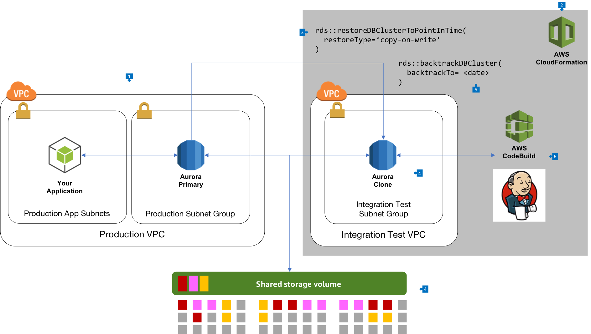

# Using Aurora Clone and Backtrack for Application Testing

## Overview

Amazon [Aurora Mysql](https://docs.aws.amazon.com/AmazonRDS/latest/AuroraUserGuide/Aurora.AuroraMySQL.html) supports two powerful capabilities which can be leveraged in a variety of ways to facilitate advanced application architectures. First, [Database Cloning](https://docs.aws.amazon.com/AmazonRDS/latest/AuroraUserGuide/Aurora.Managing.Clone.html) creates a point-in-time copy of a running database very quickly, and this clone is a full copy of the primary. However, Aurora doesn't duplicate the underlying database storage, and instead implements a copy-on-write model, where only new data is changed in the Aurora shared storage layer. Second, we can use [Aurora Backtrack](https://docs.aws.amazon.com/AmazonRDS/latest/AuroraUserGuide/AuroraMySQL.Managing.Backtrack.html) to move the cloned database back to a point in time that we require, again in just a few minutes.

## Integration Testing

As you build a service based architecture and applications, you will create new versions of a given service, and will want to integration test this with other components to determine if you've introduced any errors, or resolved issues in your service. The new version of your service may have changes to the database, and having to maintain a separate test environment which contains a copy of the database in a suitable format can be cumbersome to create an maintain.

Aurora clones give us a powerful mechanism to create copies of a production database without having to wait for full restoration, and without the duplicated cost of provisioned storage. You can use the clone for a period of time, and then quickly tear it down when you are finished testing, While it is up, only your application will have access to the clone, and from any production database you can create up to 15 clones, enabling 15 of these types of operations at one time. 

## Walkthrough of the Architecture

1. In this architecture, your application uses Amazon Aurora, and has configured the database for Backtrack. This typically resides in a Production Virtual Private Cloud (VPC) network.
2. Your integration test is scheduled to run in whatever manner suits your application. This schedule can run a CloudFormation template (or any other type of provisioning tool) to create the entire integration testing cloud environment, including the network, databases, and testing applications.
3. This integration testing template will call the RDS [restoreDBClusterToPointInTime](https://docs.aws.amazon.com/AmazonRDS/latest/APIReference/API_RestoreDBClusterToPointInTime.html) API to provision a clone database. When doing so, the API call provides the argument `RestoreType` with value `copy-on-write`, which will cause the new database to be a clone of the primary without duplicating the underlying data. This operation completes in only a few minutes.
4. The new clone database is provisioned, and has it's own unique DNS endpoint. This can reside in a separate VPC to keep network isolation from the production environment. It attaches to the same underlying shared Aurora storage as the primary database, and sees the data as of the `RestoreToTime` value supplied in the request to restore the database.
5. You may choose to use Aurora Backtrack to rewind the database to a previous point in time by using the [BacktrackDBCluster](https://docs.aws.amazon.com/AmazonRDS/latest/APIReference/API_BacktrackDBCluster.html) API, and at this phase may install changes to the database to simulate an 'release' to production.
6. Your integration testing framework can then run against this cloned database, to determine the correctness of your release. Once completed, the CloudFormation stack can be terminated, which will tear down all of the created resources automatically.

## Resources

__Aurora Mysql__: https://docs.aws.amazon.com/AmazonRDS/latest/AuroraUserGuide/Aurora.AuroraMySQL.html
__Clone API__: https://docs.aws.amazon.com/AmazonRDS/latest/APIReference/API_RestoreDBClusterToPointInTime.html
__Backtrack API__: https://docs.aws.amazon.com/AmazonRDS/latest/APIReference/API_BacktrackDBCluster.html
