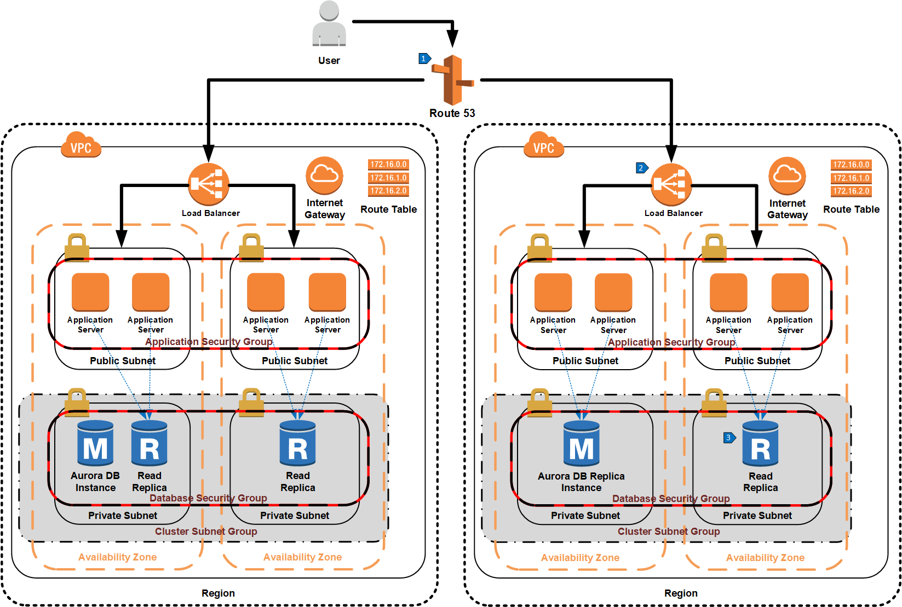

# Multi-Region Scale Out Using Aurora MySQL Read Replicas

## Overview

Aurora MySQL read replicas can also be used across regions to bring data closer to its consumers, reducing latency and increasing application performance. When a cross-region replica is created, Aurora deploys another cluster in an additional region and uses [binary replication](https://docs.aws.amazon.com/AmazonRDS/latest/AuroraUserGuide/AuroraMySQL.Replication.CrossRegion.html#AuroraMySQL.Replication.CrossRegion.Prerequisites) to keep the replica in sync. Each cluster has its own reader endpoint, so applications can use the endpoint in the region they are hosted. In this example, a Route 53 alias using latency based routing is used to route a user to the closest geographic region. Within that region, applications use the read replicas for database reads. 

## Walkthrough of the Architecture

1. Route 53 alias using latency based routing chooses a region closest to the user’s location.
2. Elastic load balancer routes traffic to one of the application servers.
3. Database read traffic from the application server is sent to the cluster reader endpoint and is served by one of the read replicas in that region.

Note that although a separate cluster is created in a different region, database write operations are still handled by the primary instance of the original cluster.
