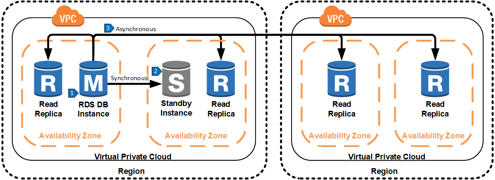
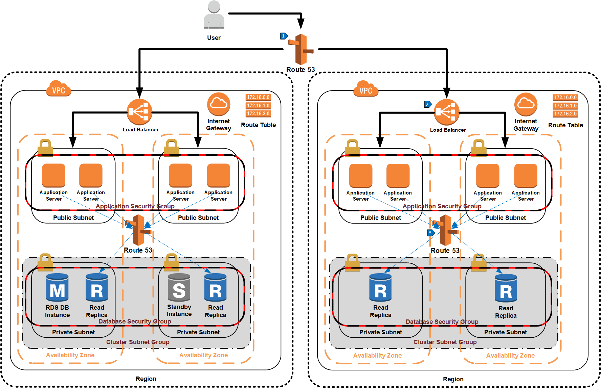

# Multi-Region Scale Out Using RDS Read Replicas

## Overview

Read replicas can be extended across geographical regions to reduce the latency between the user and the database, thus increasing application performance. In this architecture, one region has the master database that is used for all write activity to the database. Read replicas are created in different geographic regions and are kept up to date using asynchronous replication. Note that there may be additional replication lag when replicating across regions compared to replication within a single region.

## Data Replication Steps

1. All application write traffic is handled by the master database.
2. Data from the master database is replicated synchronously to a standby database in another availability zone and in the same region for high availability.
3. Data from the master database is replicated asynchronously to one or more read replicas. Application read traffic reads from a replica located in the same region as the application infrastructure.

In the same way Route 53 was used to distribute read queries across multiple read replicas in a single region, another DNS endpoint can be created for read replicas in an additional region. This additional region consists of application servers that send their read queries to read replicas in their local region. The key difference with this architecture is that a Route 53 alias is created that uses latency based routing to redirect a user to the closest region.

## Walkthrough of the Architecture

1. Route 53 alias using latency based routing chooses a region closest to the user’s location.
2. Elastic load balancer routes traffic to one of the application servers.
3. Route 53 routes database read traffic from the application server to one of the read replicas in that region.
