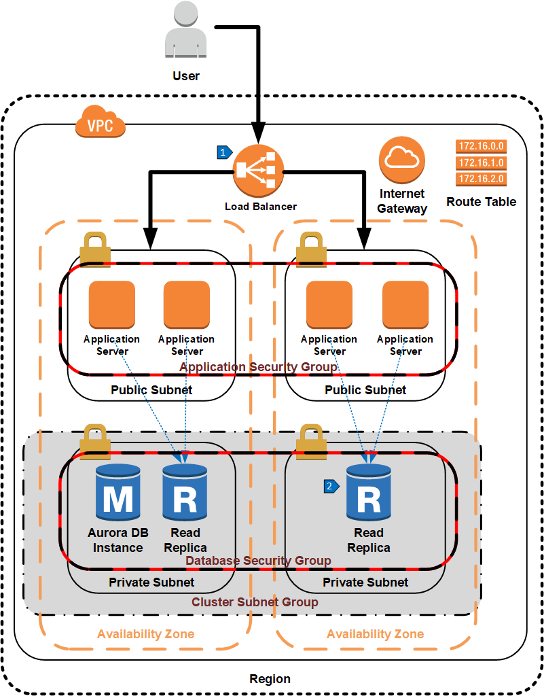

# Single Region Scale Out Using Aurora Read Replicas

## Overview

Using RDS read replicas requires substantial configuration. Route 53 must be set up to distribute queries across replicas. In addition, the standby instance cannot be used for application queries. An Aurora MySQL or PostgreSQL cluster greatly simplifies this architecture. An Aurora cluster comes with both a cluster endpoint for writes and a separate reader endpoint for reads. The reader endpoint automatically distributes read queries across up to fifteen  read replicas in the same region. There is no need to configure Route 53 to distribute this traffic. In addition, read replicas can be used as failover instances; a separate hot standby instance is unnecessary for high availability. If the master database is not available, one of the read replicas will be promoted to the primary instance. 

## Walkthrough of the Architecture

1. Elastic load balancer routes traffic to one of the application servers.
2. Database read traffic from the application server is sent to the cluster reader endpoint and is served by one of the read replicas.
