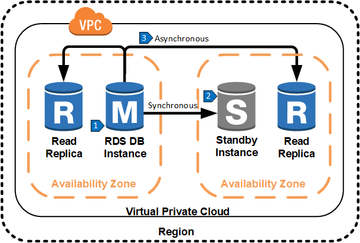
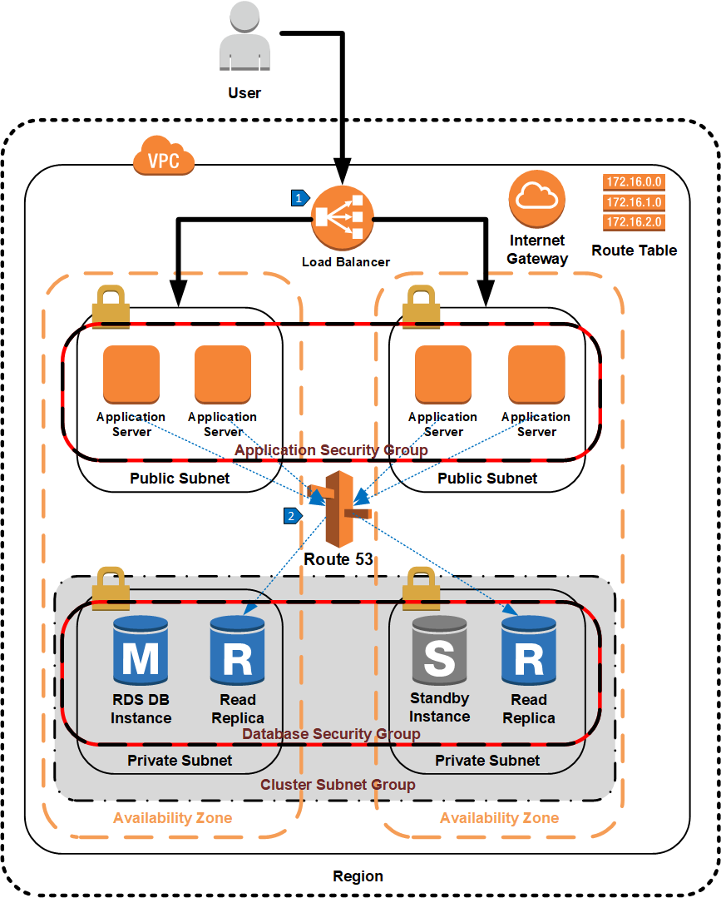

# Single Region Scale Out Using RDS Read Replicas

## Overview

Amazon RDS Read Replicas provide enhanced performance for database instances by allowing a read-heavy database workload to elastically scale out beyond the capacity constraints of a single database instance. One or more replicas of a source database instance can be created to serve high-volume application read traffic from multiple copies of the data, thereby increasing aggregate read throughput. Data is replicated asynchronously from the master database to read replicas that are used by the application for all read operations. This reduces the load on the master database, which is used exclusively for writes. In this architecture, it is still necessary to replicate data synchronously to a hot standby instance in a separate availability zone than the master database for high availability. Note that the standby cannot be used for queries.

## Data Replication Steps

1. All application write traffic is handled by the master database.
2. Data from the master database is replicated synchronously to a standby database in another availability zone for high availability.
3. Data from the master database is replicated asynchronously to one or more read replicas. Application read traffic reads from these replicas.

Amazon Route 53 can be used to create a single DNS endpoint that is used to distribute read queries across multiple read replicas in a single region. Note that it is up to the application to direct read queries from the master database instance to the DNS address for the read replicas. The RDS service cannot automatically redirect read queries sent to the master database instance to a read replica.

## Walkthrough of the Architecture

1. An elastic load balancer routes traffic to one of the application servers.
2. Route 53 routes database read traffic from the application server to one of the read replicas.

## Resources

[Amazon RDS Read Replicas](https://aws.amazon.com/rds/details/read-replicas/)

[Working with Read Replicas of MariaDB, MySQL, and PostgreSQL DB Instances](https://docs.aws.amazon.com/AmazonRDS/latest/UserGuide/USER_ReadRepl.html)

