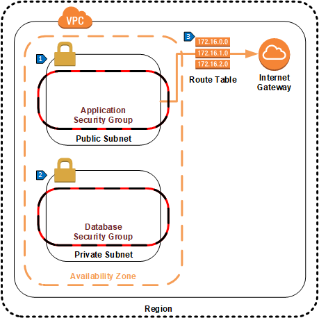
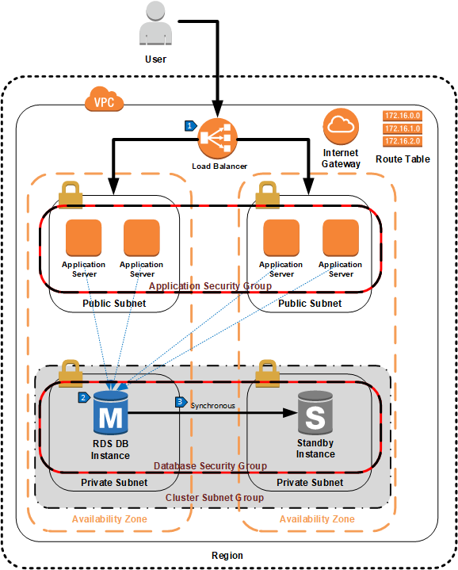

# Single Region with Hot Standby

## Overview

The simplest recommended deployment architecture for an application with an RDS instance consists of one database instance that serves all requests, and a second standby instance for high availability. In this configuration, the database is deployed to a private subnet that is not accessible to the internet. The application is deployed to public subnets that are accessible to the internet. Security groups control traffic between services deployed to the public and private subnets.

## Networking Design

This is the most basic building block for deploying an application and RDS instance. For simplicity, a single availability is shown here, but it is recommended to extend this architecture across multiple availability zones for high availability. All of the more complex architectures build on this VPC approach by adding additional availability zones and/or regions.

## Walkthrough of the Architecture

1. A public subnet is created for the application servers, which are deployed in a security group that allows inbound connections on ports needed for the application (e.g. ports 80 or 443 for a web application). Additional inbound rules may be added for admin access, such as port 22 for SSH or 3389 for Remote Desktop. Access to these admin ports should be restricted to expected CIDR address blocks.

2. A private subnet is created in the VPC to deploy the RDS instance. This subnet will not have any internet connectivity. A security group is created with inbound rules that allow database connections from a separate application security group, limited only to the ports needed for database connections. For high availability, the database security group can be extended to instances deployed in additional availability zones in the same region, as shown in the next section.

3. A custom route table sends traffic to the internet (destination of 0.0.0.0/0) to the internet gateway. The public subnet is associated with this route table, allowing internet traffic. The private subnet should not be associated with the route table, otherwise the database will be publicly accessible.

## Single Region Deployment

In this example, an application is deployed in two availability zones in a single region. An elastic load balancer routes user requests across multiple application servers. A subnet group is created for the RDS instance, and the private subnets from each availability zone are added to the subnet group. Finally, an RDS instance and standby are deployed.

## Walkthrough of the Architecture

1. An elastic load balancer routes traffic to one of the application servers across multiple availability zones.
2. All database traffic is sent to the primary database.
3. Changes to the data in the primary database are synchronously replicated to the standby database in another availability zone.
